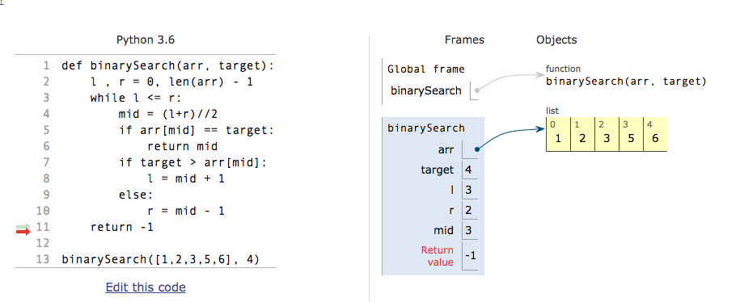
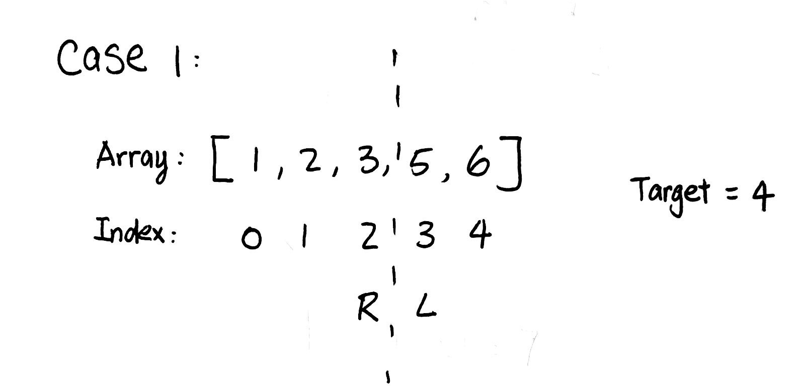
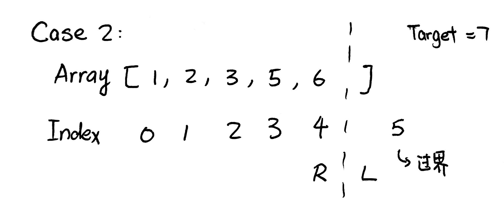

# Binary Search


# Template

## Template one

```python
def binarySearch(arr, target):
    l , r = 0, len(arr) - 1  
    while l <= r:            
        mid = (l+r)//2
        if arr[mid] == target:
            return mid
        if target > arr[mid]:
            l = mid + 1
        else:
            r = mid - 1 
    return -1

```

## Template two
```python
def binary_search(array, target):
    start, end = 0, len(array) - 1
    while start + 1 < end:
        mid = (start + end) / 2
        if array[mid] == target:
            start = mid
        elif array[mid] < target:
            start = mid
        else:
            end = mid

    if array[start] == target:
        return start
    if array[end] == target:
        return end
    return -1

```

# Without Exact Target
# find the minimum value larger than Target

## Case 1

```
Array = [1,2,3,5,6], Target = 4
```






for the template, when while loop stop:

L means the first num larger than 4, which is the minimum value larger than the target.

R means the last num smaller than 4, which is the maximum value smaller than the target.


## Case 2

```
Array = [1,2,3,5,6], Target = 7
```



As you can see, if we want to return arr[L], will out of boundary.

## example - 35. Search Insert Position
```python
class Solution:
    def searchInsert(nums, target):
        l, r = 0, len(nums) - 1
        while l <= r:
            mid = l + (r-l)//2
            if nums[mid] == target:
                return mid
            if target > nums[mid]:
                l = mid + 1
            else:
                r = mid - 1
        return l
```

```
Input: [1,3,5,6], 2
Output: 1
```

l value is 1, which is the first value meeting the target requirement.

r value is 0, which is the last value not meeting the target requirement.

## example - 458. Last Position of Target (Lintcode)

```python
class Solution:
    def lastPosition(self, nums, target):
        if not nums:
            return -1
        l , r = 0 , len(nums) - 1
        while l <= r:
            mid = l + (r-l)//2
            if nums[mid] <= target:
                l = mid + 1
            else:
                r = mid - 1
        if nums[r] == target:
            return r
        else:
            return -1
```

For repeating value of target, increase the left value when nums[mid] == target.

## example 162. Find Peak Element

```python
class Solution:
    def findPeakElement(self, nums):
        """
        :type nums: List[int]
        :rtype: int
        """
        l , mid , r = 0, 0, len(nums) - 1
        while l + 1 < r:
            mid = l + (r-l)//2
            if nums[mid] < nums[mid + 1]:
                l = mid
            else:
                r = mid 
        if nums[l] > nums[r]: return l
        else: return r
```

## example 153. Find Minimum in Rotated Sorted Array

```python
class Solution(object):
    def findMin(self, nums):
        """
        :type nums: List[int]
        :rtype: int
        """
        l, r = 0, len(nums) - 1
        while l + 1 < r:
            mid = l + (r - l) // 2
            if nums[mid] > nums[r]:
                l = mid
            else:
                r = mid 
        return min(nums[l], nums[r])
```

# Example

## Search in Rotated Sorted Array

```python
class Solution:
    def search(self, nums, target):
        """
        :type nums: List[int]
        :type target: int
        :rtype: int
        """
        if not nums: return -1
        l , r = 0, len(nums) - 1
        
        while l <= r:
            mid = l + (r-l)//2
            if target == nums[mid]:
                return mid
            if nums[mid] >= nums[l]:
                if nums[l] <= target <= nums[mid]:
                    r = mid - 1
                else:
                    l = mid + 1
            else:
                if nums[mid] <= target <= nums[r]:
                    l = mid + 1
                else:
                    r = mid - 1
        return -1
```


